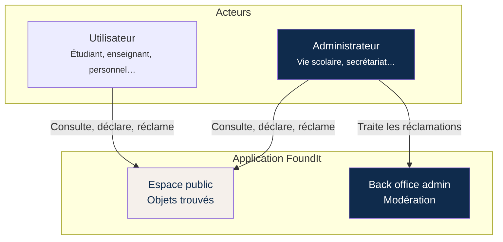
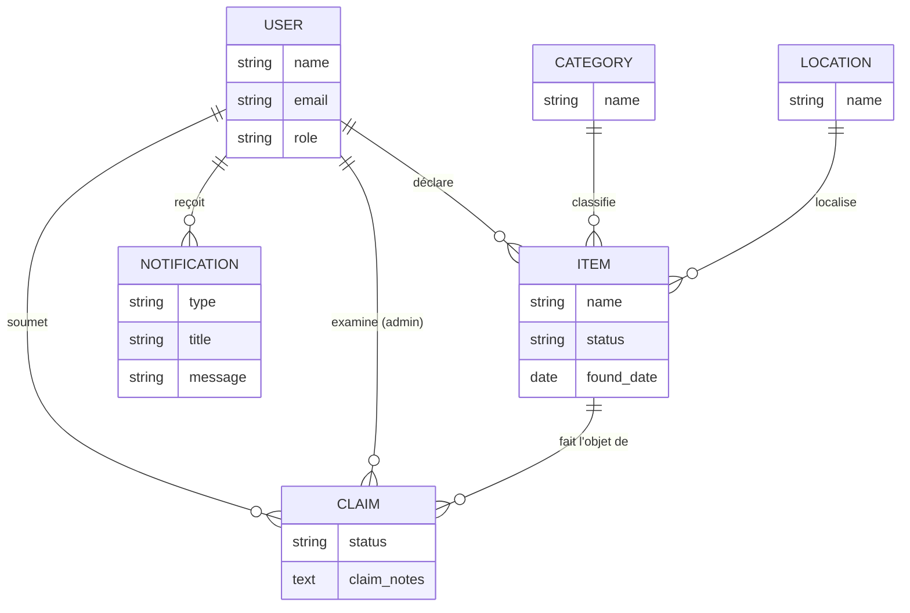
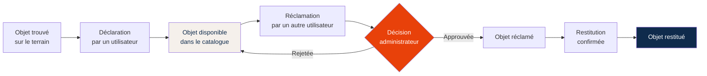
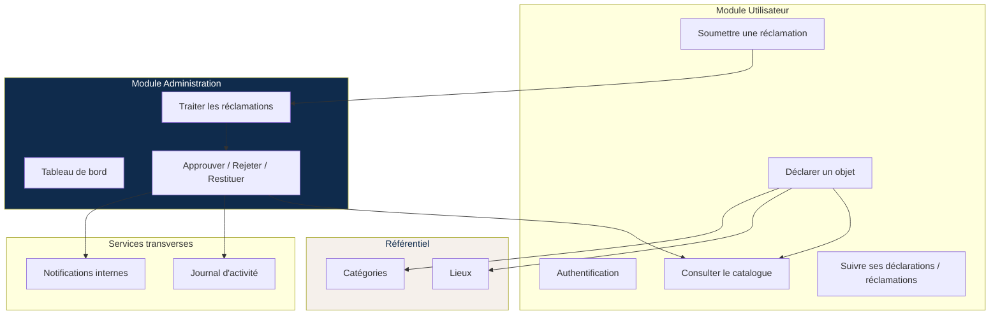
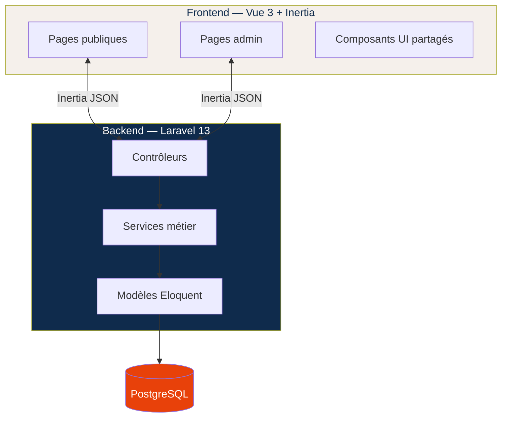

# FoundIt — Architecture fonctionnelle

Document de référence pour comprendre l'organisation du projet FoundIt (PFE).  
Il sépare volontairement la **vue métier** (ce que fait l'application) de la **vue technique** (comment elle est construite).

---

## 1. Acteurs et responsabilités

| Acteur | Rôle en base | Accès |
|--------|--------------|-------|
| Utilisateur | `user` | Application publique uniquement |
| Administrateur | `admin` | Application publique + back office `/admin` |

---

## 2. Entités métier et relations

### Statuts principaux

**Objet trouvé (`items.status`)**

| Statut | Signification |
|--------|---------------|
| `available` | Visible, aucune réclamation approuvée |
| `claimed` | Réclamation approuvée, en attente de restitution |
| `returned` | Restitué au propriétaire |

**Réclamation (`claims.status`)**

| Statut | Signification |
|--------|---------------|
| `pending` | En attente de décision admin |
| `approved` | Acceptée — l'objet passe en `claimed` |
| `rejected` | Refusée — l'objet reste `available` |

---

## 3. Flux métier — cycle de vie d'un objet

---

## 4. Interactions entre modules

---

## 5. Vue technique simplifiée

| Couche | Rôle |
|--------|------|
| **Pages Vue** | Interface utilisateur, formulaires, tableaux |
| **Contrôleurs** | Réception des requêtes, validation, réponse Inertia |
| **Services** | Logique métier (workflow réclamations, statistiques, notifications) |
| **Modèles** | Représentation des entités et relations en base |

---

## 6. Périmètre actuel du projet

**Implémenté**

- Authentification (connexion, inscription, profil)
- Catalogue d'objets trouvés (recherche, filtres)
- Déclaration d'objets (catégorie, lieu)
- Réclamations utilisateur
- Back office : tableau de bord, traitement des réclamations
- Notifications et journal d'activité (côté backend)

**Non implémenté à ce jour**

- Interfaces admin : gestion utilisateurs, catégories, lieux, centre de notifications, paramètres

---

*Document généré pour le projet FoundIt — à utiliser comme support de présentation PFE.*
